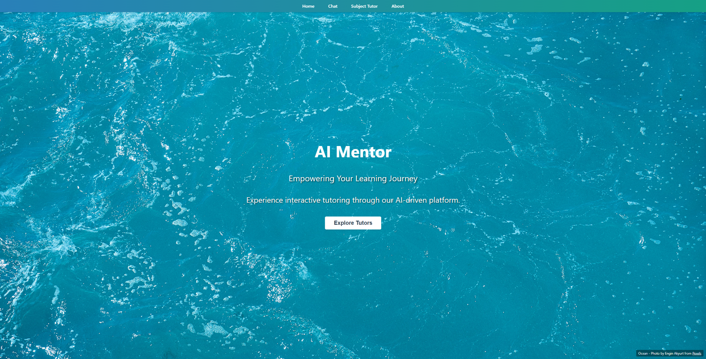

# AI Mentor Website

A web-based AI tutoring platform that provides personalized learning experiences in Biology and Python programming.



## Overview

AI Mentor is a React-based web application that leverages fine-tuned AI models to offer specialized tutoring in different subject areas. The platform features interactive chat interfaces, flashcards, quizzes, and progress tracking to enhance the learning experience.

## Features

- **Specialized AI Tutors**: Fine-tuned models specifically trained for Biology and Python
- **Interactive Chat**: Ask questions and receive detailed explanations
- **Smart Learning Activities**:
  - Flashcards for memorizing key concepts
  - Quizzes with AI-powered evaluation and feedback
  - Topic-specific exercises
- **Progress Tracking**: Monitor your learning journey with detailed statistics

## Tech Stack

- **Frontend**: React, React Router
- **Styling**: CSS with custom styling
- **API Integration**: Custom API services for AI interaction
- **State Management**: React Context API
- **Authentication**: JWT-based authentication system
- **Backend**: Node.js/Express (separate repository)
- **Database**: MongoDB (separate repository)

## Getting Started

### Prerequisites

- Latest Node.js
- API access 

### Installation

1. Clone the repository
   ```
   git clone https://github.com/RakibR7/AI_Mentor_Website.git
   cd AI_Mentor_Website
   ```

2. Install dependencies
   ```
   npm install
   ```

3. Create a `.env` file in the root directory with the following variables:
   ```
   REACT_APP_API_URL=https://api.teachmetutor.academy
   ```

4. For local development  Open [http://localhost:3000](http://localhost:3000) in your browser
   ```
   then: npm start
   ```


## API Integration

This application relies on a separate backend API for AI interactions, user management, and data storage. By default, it connects to the production API at `https://api.teachmetutor.academy`.

For local development or custom deployments, you can specify your own API endpoint in the `.env` file.

## Deployment

The project can be deployed to any static hosting service:

1. Build the production version
   ```
   npm run build
   ```

2. Deploy the contents of the `build` directory to your hosting service such as Netlify
   
3. You can also just drag and drop the new `build` and it will auto deploy for you
   
**4. Certificates, domain name and env settings need to be all changed to your own settings**

### Netlify Deployment

This project includes Netlify configuration:

```
netlify deploy --prod
```

## Related Projects

- **Mobile App**: [AI Mentor Mobile](https://github.com/RakibR7/AI_Mentor_Mobile)
- **Backend API**: [AI Mentor Backend](https://github.com/RakibR7/AI_Mentor_Backend)


## Acknowledgments

- Special thanks to the team at OpenAI for the underlying AI models
- Background images from [Pexels](https://www.pexels.com/)
- Defocused image background from [Pexels](https://www.pexels.com/photo/defocused-image-of-lights-255379/)
